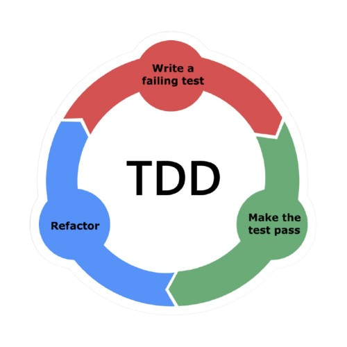

<h1 align='center'>
  Hi there 
</h1>

<h1 align="center">
  🎓 Who am I?
</h1>

- ### Developer

  Currently studying at Epitech Technology, Paris
- ### Passionate about Financial Development

  I have a strong interest in applications and solutions that enhance financial management, including accounting software, financial data analysis, and innovative fintech.
- ### Portfolio
  Soon ...

<h1 align="center">
  💻 Programming Languages
</h1>

   
   
  
  
  
  
  
  
  

<h1 align="center">
  🛠️ Tools
</h1>

  
  
  
  
  

<h1 align="center">
  📊 Work Methodology
</h1>

  
  
  
  

<h1 align="center">
  📊 GitHub Statistics
</h1>

  

  

<h1 align="center">
  🔗 Connect with me
</h1>

  
  

